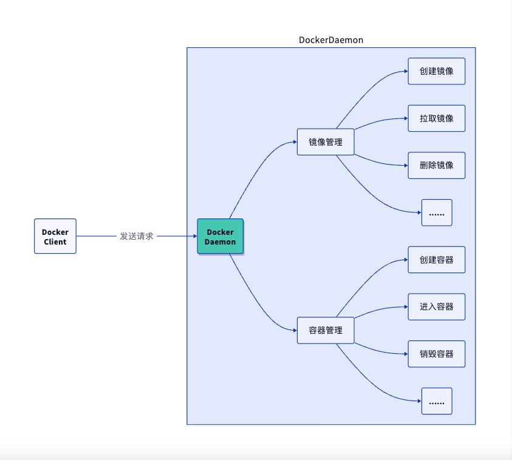

+++
authors = ["lzy"]
title = "docker 快速入门"
date = "2025-02-24 16:42:00"
description = ""
tags = [
    "linux"
]
categories = [
    "技术文档"
]
+++

# docker 快速入门

## docker 安装

删除旧版本

```bash
yum remove docker \
           docker-client \
           docker-client-latest \
           docker-common \
           docker-latest \
           docker-latest-logrotate \
           docker-logrotate \
           docker-selinux \
           docker-engine-selinux \
           docker-engine
```

更新源

```bash
vim /etc/yum.repos.d/docker-ce.repo
```

```bash
#启用哪个版本的源就将其下的enable值设置为1，其余设置为0
[docker-ce-stable]
name=Docker CE Stable - $basearch
baseurl=https://download.docker.com/linux/centos/7/$
basearch/stable
enabled=1
gpgcheck=1
gpgkey=https://download.docker.com/linux/centos/gpg

[docker-ce-stable-debuginfo]
name=Docker CE Stable - Debuginfo $basearch
baseurl=https://download.docker.com/linux/centos/7/debug-$
basearch/stable
enabled=0
gpgcheck=1
gpgkey=https://download.docker.com/linux/centos/gpg

[docker-ce-stable-source]
name=Docker CE Stable - Sources
baseurl=https://download.docker.com/linux/centos/7/source/stable
enabled=0
gpgcheck=1
gpgkey=https://download.docker.com/linux/centos/gpg

[docker-ce-edge]
name=Docker CE Edge - $basearch
baseurl=https://download.docker.com/linux/centos/7/$
basearch/edge
enabled=0
gpgcheck=1
gpgkey=https://download.docker.com/linux/centos/gpg

[docker-ce-edge-debuginfo]
name=Docker CE Edge - Debuginfo $basearch
baseurl=https://download.docker.com/linux/centos/7/debug-$
basearch/edge
enabled=0
gpgcheck=1
gpgkey=https://download.docker.com/linux/centos/gpg

[docker-ce-edge-source]
name=Docker CE Edge - Sources
baseurl=https://download.docker.com/linux/centos/7/source/edge
enabled=0
gpgcheck=1
gpgkey=https://download.docker.com/linux/centos/gpg

[docker-ce-test]
name=Docker CE Test - $basearch
baseurl=https://download.docker.com/linux/centos/7/$
basearch/test
enabled=0
gpgcheck=1
gpgkey=https://download.docker.com/linux/centos/gpg

[docker-ce-test-debuginfo]
name=Docker CE Test - Debuginfo $basearch
baseurl=https://download.docker.com/linux/centos/7/debug-$
basearch/test
enabled=0
gpgcheck=1
gpgkey=https://download.docker.com/linux/centos/gpg

[docker-ce-test-source]
name=Docker CE Test - Sources
baseurl=https://download.docker.com/linux/centos/7/source/test
enabled=0
gpgcheck=1
gpgkey=https://download.docker.com/linux/centos/gpg

[docker-ce-nightly]
name=Docker CE Nightly - $basearch
baseurl=https://download.docker.com/linux/centos/7/$
basearch/nightly
enabled=0
gpgcheck=1
gpgkey=https://download.docker.com/linux/centos/gpg

[docker-ce-nightly-debuginfo]
name=Docker CE Nightly - Debuginfo $basearch
baseurl=https://download.docker.com/linux/centos/7/debug-$
basearch/nightly
enabled=0
gpgcheck=1
gpgkey=https://download.docker.com/linux/centos/gpg

[docker-ce-nightly-source]
name=Docker CE Nightly - Sources
baseurl=https://download.docker.com/linux/centos/7/source/nightly
enabled=0
gpgcheck=1
gpgkey=https://download.docker.com/linux/centos/gpg
```

查看当前源的可用版本

```bash
yum list docker-ce --showduplicates|grep "^doc"|sort -r
```

- dockerfile 关键字

```
FROM            //指定基础镜像
MAINTAINER        //发布者邮箱
RUN                //构建命令
EXPOSE            //暴露端口
WORKDIR            //工作路径
ENV                //环境变量
ADD                //添加宿主机文件->容器
COPY              //同上
VOLUME            //指定容器数据卷
CMD                //容器启动时要运行的命令
ENTRYPOINT        //同上
```

## docker 常用命令

Docker 是一个开源的应用容器引擎，让开发者可以打包他们的应用以及依赖包到一个可移植的镜像中，然后发布到任何流行的 Linux 或 Windows 机器上，也可以实现虚拟化，容器是完全使用沙箱机制，相互之间不会有任何接口

```bash
docker info                 #查看docker信息
docker inspect {image_id}/{container_id}    #查看镜像或容器详情
docker save -o images.tar    #导出镜像为tar包
docker export -o images.tar {container_id}    #导出容器为tar包
docker load < images.tar              #导入save出来的包
docekr import images.tar image:tag    #导入export出来的包
docker image/system prune -a    #清理无用镜像
docker pull --platform arm64 ${image_id}    #多架构构建指定架构拉镜像

#开启并行构建
在/etc/docker/daemon.json中设置{ "features": { "buidkit": true }}
#制作镜像
docker commit [-a author] [-m desc] container_id images:tag
#运行容器
docker run -d -it --name mysql_test -p 3306:3306 -e MYSQL_ROOT_PASSWORD=abcdefg mysql
#docker 分析工具
yay -S dive
dive [image_id]

docker images    # 列出镜像
docker ps -a     # 列出容器
docker search    # 查找镜像
docker pull      # 拉取镜像
docker rmi/rm -f
docker start/restart/stop/kill
docker exec
docker cp [容器id]:[容器内路径] [主机路径]
docker load -i
docker network ls
docker network create
```

## docker 镜像加载原理

docker 的镜像实际上由一层一层的文件系统组成，这种层级的文件系统 UnionFS.

bootfs(boot file system)主要包含 bootloader 和 kernel, bootloader 主要是引导加载 kernel, Linux 刚启动时会加载 bootfs 文件系统，在 Docker 镜像的底层是 bootfs。

这一层与我们典型的 Linux/Unix 系统是 一样的，包含 boot 加载器和内核。当 boot 加载完成之后整个内核就都在内存中了，此时内存的使用权已 由 bootfs 转交给内核，此时系统也会卸载 bootfs.

rootfs (root file system) ，在 bootfs 之上，包含的就是典型 Linux 系统中的 /dev, /proc, /bin, /etc 等标 准目录和文件。rootfs 就是各种不同的操作系统发行版，比如 Ubuntu，Centos 等等。

所有的 Docker 镜像都起始于一个基础镜像层，当进行修改或增加新的内容时，就会在当前镜像层之 上，创建新的镜像层。


## docker 降级

```bash
yum list installed | grep docker
systemctl stop docker.service
yum downgrade --setopt=obsoletes=0 -y docker-ce-${version} docker-ce-selinux-${version}
yum downgrade --setopt=obsoletes=0 -y docker-ce-19.03.13-3.el7 docker-ce-cli-19.03.13-3.el7 containerd.io
```

## docker 镜像瘦身

Docker 镜像是由很多镜像层（Layers）组成的（最多 127 层）

Dockerfile 中的每条指定都会创建镜像层，不过只有 `RUN`, `COPY`, `ADD` 会使镜像的体积增加

- 精简层数的方法有如下几种：

  1. RUN 指令合并
  2. 多阶段构建
- 精简每一层的方法有如下几种：

  1. 使用合适的基础镜像（首选 alpine）
  2. 删除 RUN 的缓存文件

```bash
#查看每一层的大小
docker history image_id
#无缓存
docker build --no-cache -t optimize/redis:multiline -f redis_multiline .
#清理缓存文件
yum clean all && history -cw
#查看/目录文件大小
du -h --exclude=/proc --exclude=/sys /
#根目录下：
tar --exclude=/proc --exclude=/sys --exclude=base_img.tar -cvf base_img.tar / > /dev/null
#退出容器，压缩包拷贝出来
docker cp [容器id]:/base_img.tar .
#导入
cat base_img.tar|docker import - base_img
#history,只有一个记录：Imported from -
docker history [新镜像id]
```

参考： [Docker 镜像瘦身](https://blog.haojunyu.com/post/docker_image_slim/)

## docker 构建多架构镜像

```bash
docker manifest create images:latest images:x86 images:arm
docker manifest push images:latest
docker manifest rm images:latest # 删除本地manifest
docker manifest inspect images:latest # 查看镜像manifest
```

docker 使用 buildx 构建多架构镜像

- 新建 builder

```bash
# 适用于国内环境
docker buildx create --use --name=mybuilder-cn --driver docker-container --driver-opt image=dockerpracticesig/buildkit:master
# 适用于腾讯云环境(腾讯云主机、coding.net 持续集成)
docker buildx create --use --name=mybuilder-cn --driver docker-container --driver-opt image=dockerpracticesig/buildkit:master-tencent
# $ docker buildx create --name mybuilder --driver docker-container
$ docker buildx use mybuilder
```

- Dockerfile
  - **TARGETPLATFORM: **构建镜像的目标平台，例如 `linux/amd64`, `linux/arm/v7`, `windows/amd64`
  - **TARGETOS: **`TARGETPLATFORM` 的 OS 类型，例如 `linux`, `windows`
  - **TARGETARCH: **`TARGETPLATFORM` 的架构类型，例如 `amd64`, `arm`
  - **BUILDPLATFORM: **构建镜像主机平台，例如 `linux/amd64`
  - **BUILDOS: **`BUILDPLATFORM` 的 OS 类型，例如 `linux`
  - **BUILDARCH: **`BUILDPLATFORM` 的架构类型，例如 `amd64`
  - **BUILDVARIANT: **`BUILDPLATFORM` 的变种，该变量可能为空，例如 `v7`
  - **TARGETVARIANT: **`TARGETPLATFORM` 的变种，该变量可能为空，例如 `v7`

```bash
FROM --platform=$TARGETPLATFORM alpine
 
RUN uname -a > /os.txt
 
CMD cat /os.txt
```

- 构建镜像

```bash
$ docker buildx build --platform linux/arm,linux/arm64,linux/amd64 -t myusername/hello . --push
 
# 查看镜像信息
$ docker buildx imagetools inspect myusername/hello
```

## docker 开启 manifest

- 永久开启

```bash
$vim /etc/docker/daemon.json
{
  "experimental": true
}
systemctl restart docker
```

- 临时开启

```bash
export DOCKER_CLI_EXPERIMENTAL=enabled
```

## Docker 通过代理服务器拉取镜像



1. 创建 dockerd 相关的 systemd 目录，这个目录下的配置将覆盖 dockerd 的默认配置

```go
sudo mkdir -p /etc/systemd/system/docker.service.d
```

2. 新建配置文件 `/etc/systemd/system/docker.service.d/http-proxy.conf`，这个文件中将包含环境变量

```go
[Service]
Environment="HTTP_PROXY=http://proxy.example.com:80"
Environment="HTTPS_PROXY=https://proxy.example.com:443"
```

3. 如果你自己建了私有的镜像仓库，需要 dockerd 绕过代理服务器直连，那么配置 `NO_PROXY` 变量，多个 `NO_PROXY` 变量的值用逗号分隔，而且可以使用通配符（*），极端情况下，如果 `NO_PROXY=*`，那么所有请求都将不通过代理服务器

```go
[Service]
Environment="HTTP_PROXY=http://proxy.example.com:80"
Environment="HTTPS_PROXY=https://proxy.example.com:443"
Environment="NO_PROXY=your-registry.com,10.10.10.10,*.example.com"
```

4. 重新加载配置文件，重启 dockerd

```go
sudo systemctl daemon-reload
sudo systemctl restart docker
```

5. 检查确认环境变量已经正确配置

```go
sudo systemctl show --property=Environment docker
```

6. 从 `docker info` 的结果中查看配置项
