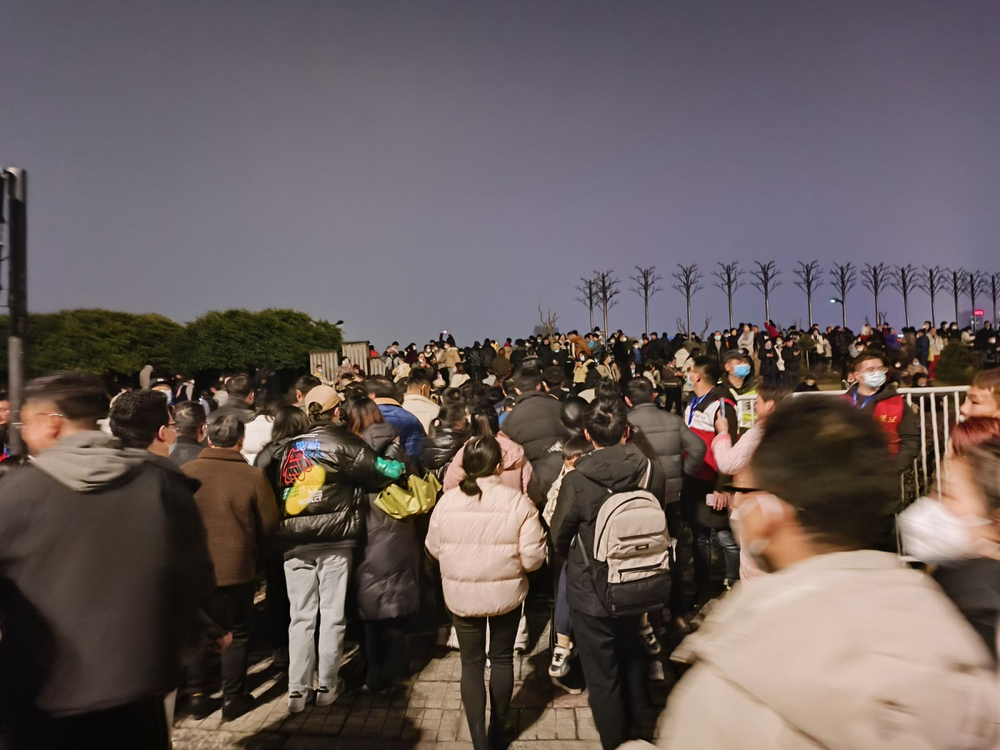
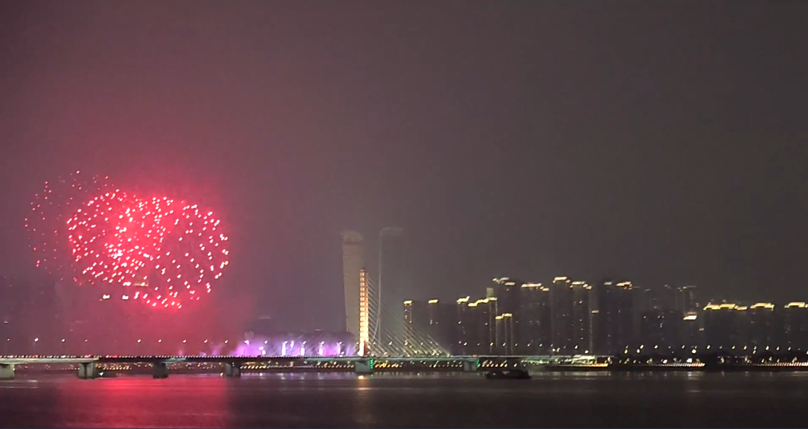
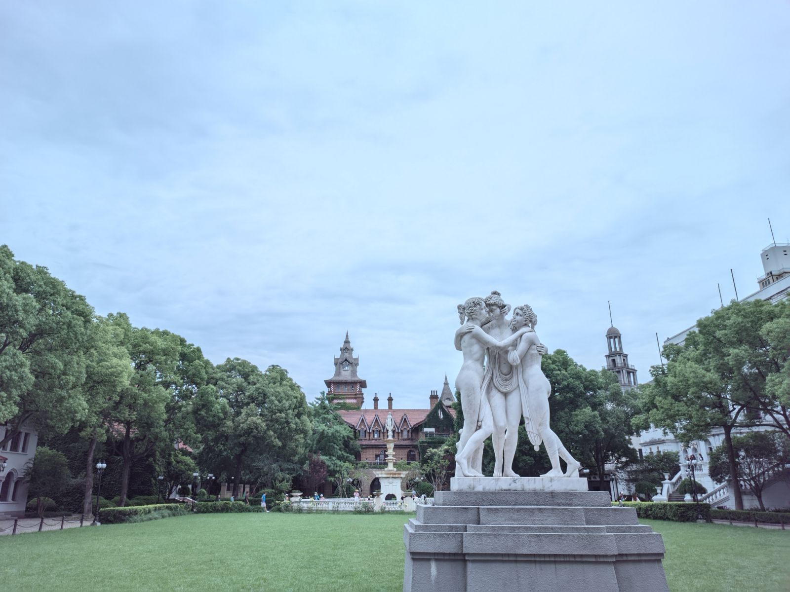
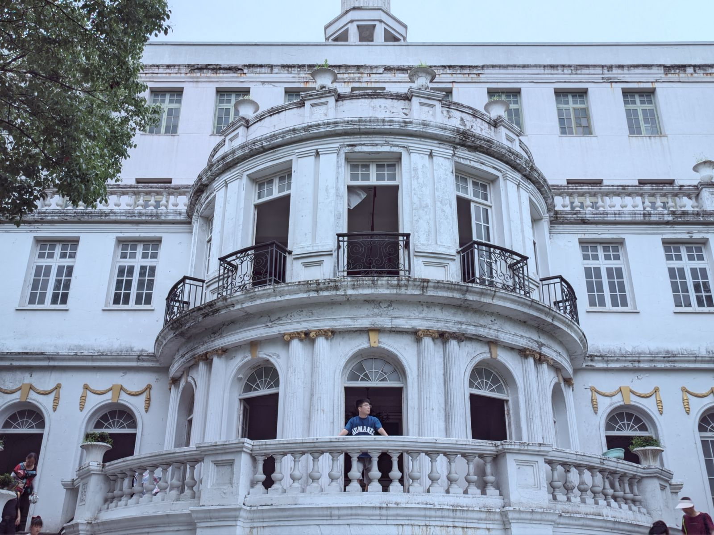
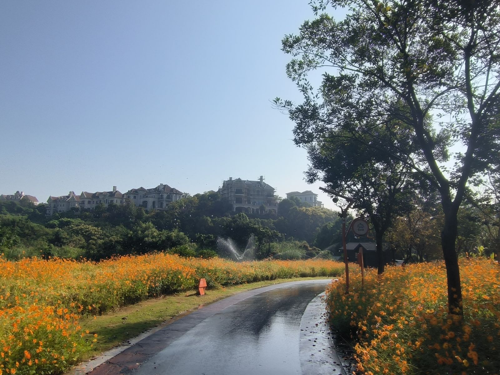
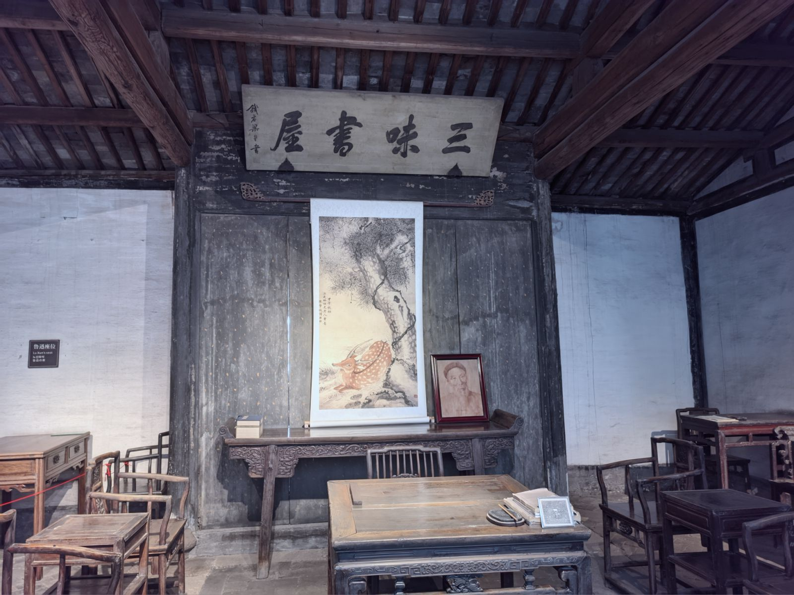
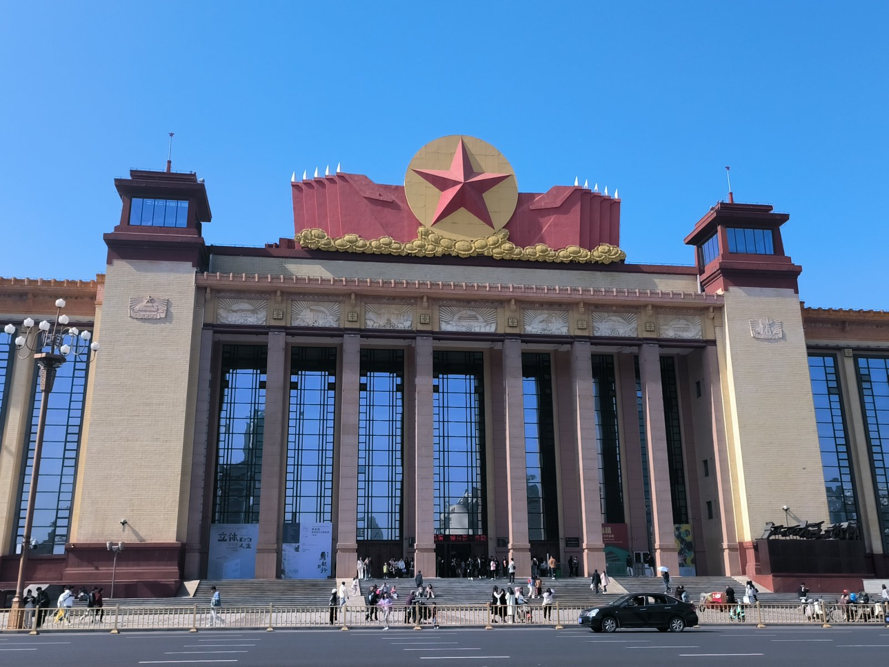
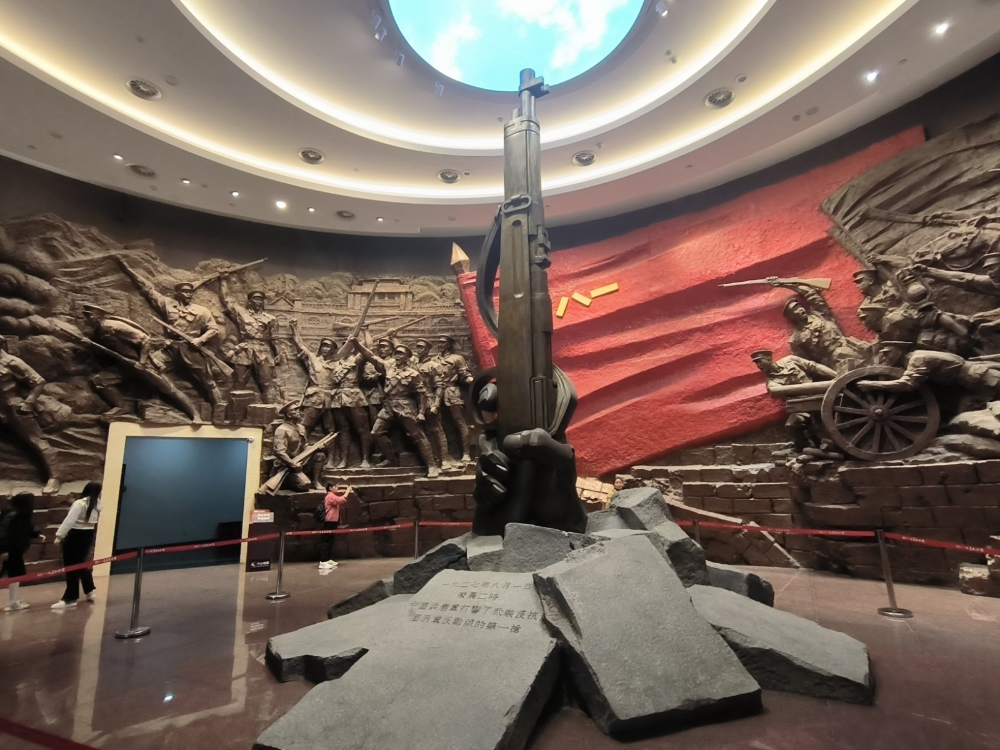

+++
authors = ["lzy"]
title = "回忆近三年工作生涯（2023）"
date = "2024-02-21"
description = ""
tags = [
    "年度总结"
]
categories = [
    "生活随笔"
]
+++

# 回忆近三年工作生涯（2023）

## 摘要

2023 年其实算是比较平淡的一年，工作基本步入正轨，生活上也没什么大的变动。

## 工作层面

年初开始接触阿里云云盾相关的业务，要把原来单机部署的项目部署在阿里云 OnPaas 环境里。

这需要 k8s 相关的知识，因此这段时间快速恶补了 k8s，学着怎么搭环境、怎么部署 pod、怎么写 helm chart，算是把 k8s 的基础知识入了门，然后在同事的帮助下，将项目成功接入了阿里云 OnPaas。这也算是一份宝贵的经验了，随后就一直维护着相关代码。

由于转正之后岗位定为了 agent 工程师，所以开始接触扫描相关的模块。与之前实习期写 web 端代码不同，那个无非就是了解业务，然后思考怎么写 crud 接口。而接触这部分代码后，了解更多风险扫描的细节，也算是了解了一些安全行业的部分内容。

所谓风险扫描，无非就是伪造请求、发请求、接收响应包，然后根据响应包的内容来判断是否存在某些漏洞。既然扫描模块的代码主要网络请求，自然离不开并发模型的设计和相关的网络编程。因此在很长一段时间内，写各种 go 并发代码和网络编程成为我的主要工作，这也加深了我对并发的理解和对网络的理解。

值得一提的是在这部分业务的开发维护中，我也踩过不少坑，以下只列举几个：

- 规则引擎层面是通过 grpc 来发起、停止扫描任务。由于历史代码的设计问题，一个任务往往要占一个 grpc 线程直到结束返回结果。但 python 的 grpc 线程池是有大小的，导致高并发场景下，任务往往会占满 grpc 线程，致使停止的 rpc 请求无法被响应。
- 引擎的内存占用问题，由于协程泄漏，导致内存只增不降，最后机器卡死。
- 扫描速率的控制和调节，如果一味的追求扫描速度，可能导致过度占用 CPU，规则检测中有大量的正则表达式非常占 CPU。

当然这些问题后续都解决了，只不过当时排查起来相当麻烦。这也是和写 web 不同的地方，前者最起码写接口时有没有 bug 可以快速定位到，而后者的问题则隐藏的更深，当然这也比较锻炼我的问题排查能力和 coding 水平。

## 生活层面

在杭州独居的生活往往一开始是十分美好的，但渐渐的会感到孤独、乏味，毕竟家乡在陕西，亲人、同学、朋友也基本在陕西，很少有到外省打工的，最多的就是去西安。

为了对抗这种感觉，我其实是给自己找了不少事情来做，例如去旅游、逛街。

### 杭州烟花大会

2023 年 2 月份，我的舍友来杭州找我，恰逢今年杭州要举办亚运会，因此在钱塘江附近有烟花秀，于是我跟他早上出发，先逛了西湖（老规矩），等到了晚上一起看了烟花秀，不过人是真多啊

最后也只能勉强拍了几张照片

### 西溪湿地赏梅

2 月底的时候，在小红书看到西溪湿地部分收费的景区可以免费进去赏梅了，于是我约上了一个同事一起去看看。

顺便拍了一些照片，感觉自己这段时间的拍照水平进步了不少！

随便秀几张图片吧（笑）

### 上海影视城

从 2 月底之后基本每天的日常生活就是上班、下班、回房间里躺平，毕竟偶尔出去逛逛可以放松心情，如果每周都出去逛就比较累人了。

这样的生活一直持续到 6 月份，我一个大学同学也来了杭州这边打工，然后我们约了另外两个附近的同学，一起打算去上海逛一逛，由于时间和路程问题，选择了最近的佘山和上海影视城。

不得不说，影视城的一些建筑和雕像还是别有一番风味的。

在此秀一张我觉得还挺满意的构图

### 青山湖骑行

从 6 月之后，又陷入了很长一段时间的平淡生活，当然在这段时间里我主要的爱好就是撸铁。从一个只有 55 公斤体重的细狗，经过大半年的锻炼，已经增长到了 65 公斤，算是进步很大了。

9 月份，我同事约我去青山湖骑车，这也是我自小学毕业之后，第一次接触骑行了。其实我小时候一直喜欢骑自行车，我的小自行车从 6 岁陪伴到我 12 岁，最终报废了，后来我就再很少骑自行车了。

青山湖周边的环境挺好，骑车的人也挺多。随手拍了几张照片就很好看。

我们是在青山湖外租的小红车，大概骑了 3-4 个小时，完成青山湖的环线，最后花费 5 块钱

实际上还是挺累的，中间有不少上坡，环线大概 40 公里左右，但周围的风景也冲淡了这种疲劳感

### 鲁迅故居

由于接受不了长期平淡的生活，于是在国庆节过后的 10 月底，我又约了朋友一起去绍兴的鲁迅故居。

可能过了节假日，鲁迅故居的人并没有我想象的多，我们非常轻松的就预约上了票。

从小学课文里就学到的《百草园和三味书屋》，也算是亲眼看到了。

下面是百草园，实际上就是很普通的一个菜园子。

### 南昌

11 月份，我的大学室友不知是什么原因寂寞难捱，非要从唐山这么远的地方跑到南昌来旅游。

然后硬是叫上了我，我们俩来了一个周末特种兵。

什么八一广场、美术馆、基本都逛了一遍，主打一个打卡式旅游

当然还有这个比较著名的滕王阁，1500 年前，一代天才王勃在这里写下了滕王阁序。

犹记得那一句“落霞与孤鹜齐飞，秋水共长天一色”，如今也是历史照进了现实。

至此，2023 年基本结束了，平淡中偶尔有些起伏。当然在 2025 年去回忆 2023 年的事情，很多记忆其实已经模糊了，唯有当时发的朋友圈，当时写的工作周报还存留，也是勉强借着这些东西来回忆下 2023 年的生活而已。

或许有一些暂时想不起来，但后续又回忆起的东西，以后会补充进来，但本文先到此结束。

纪念我失去的 2023！
